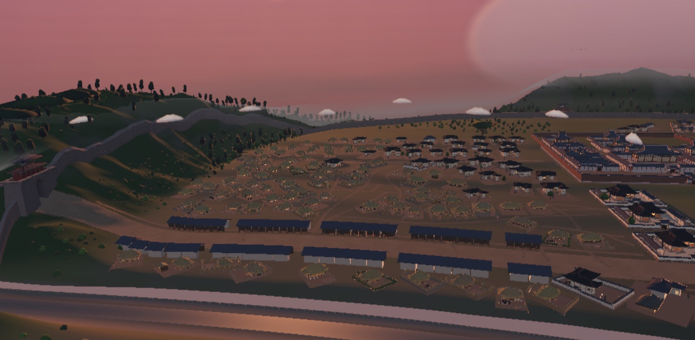
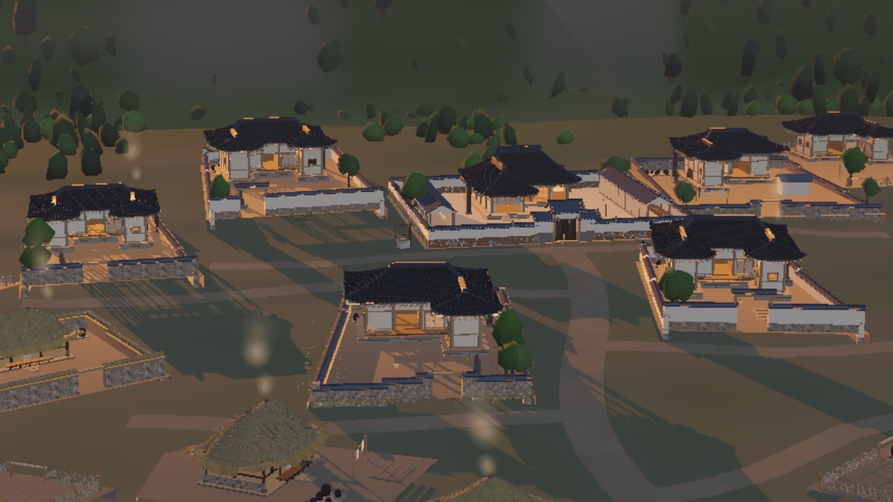
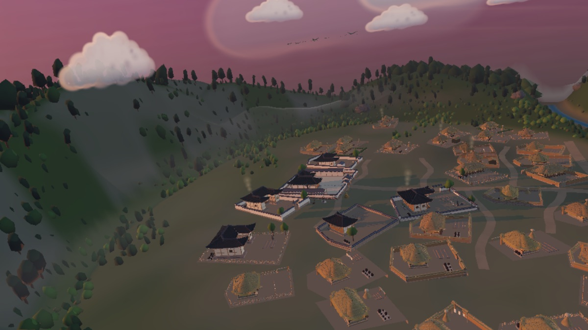
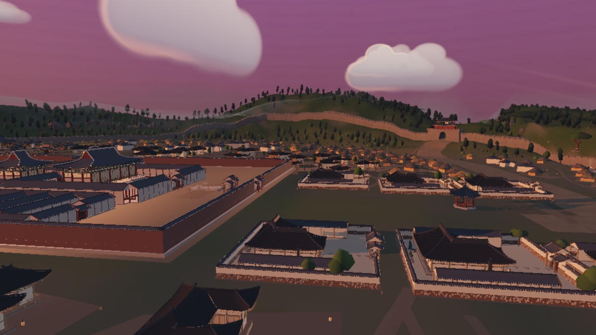

# 처마 (cheoma)

**A procedural Joseon-era Korean village, grown from a seed — in the browser.**
조선 전통건축(궁궐·사찰·기와집·초가)과 마을을 파라메트릭으로 생성하는 three.js 앱.

**Live: [cheoma.midagedev.com](https://cheoma.midagedev.com)**



| | |
| --- | --- |
|  |  |
|  |  |

<sub>근접 한옥 마당 · 필지 무리와 마당 생활상 · 산기슭 마을 · 궁역과 시전. 종가 한 채에서 도성까지, 모두 앱의 제품 경로를 그대로 캡처한 것이다.</sub>

## Features

- **파라메트릭 한옥** — 칸(間) 체계·공포·팔작지붕 곡선을 파라미터로: 지붕 물매·처마 깊이·창호·단청까지 편집
- **마을 자동 구성** — 배산임수 지형 생성, 필지·담장·고샅, 다랑이 논·개울, 산사(山寺)
- **규모 연속 슬라이더** — 외딴집·촌락부터 성곽 도성 한양(궁궐 다일곽·시전행랑·사대문)까지 하나의 연속체
- **궁궐 다일곽** — 행각으로 담을 공유하는 축선 스택 (경복궁 배치 고증)
- **시간·계절·날씨** — 골든아워 림 라이트, 눈·비, 야간 창호 불빛과 달빛. 모든 전환은 크로스페이드다
- **focus 줌 연속체** — 부감↔근접 연속 줌, 필지별 편집·조립 애니메이션·앰비언스(닭·밥 짓는 연기·바람에 흔들리는 풀)
- **드론 원테이크 투어** — 접근 → 골짜기 저공 → 지붕 위 활공 → 랜드마크 선회 → 능선 상승 → 귀환을 끊지 않고 잇는 한 번의 비행
- **1인칭 도보 탐험** — WASD·방향키·드래그(모바일은 가상 조이스틱)로 고샅과 마당을 직접 걷는다
- **마을 리롤 웨이브** — 새 시드로 다시 지을 때 지형·길·필지·숲의 세대 교체를 먹안개 베일 아래에서 한 프레임에 넘긴다
- **glTF/GLB 내보내기** — 인스턴싱을 `EXT_mesh_gpu_instancing`으로 보존한 채 씬을 내보낸다
- **씬 공유 URL** — 시드·규모·시간·계절·카메라가 URL에 실려, 링크 하나가 같은 장면을 그대로 재현한다

## Technical highlights

three.js로 큰 절차적 씬을 만드는 사람에게 흥미로울 만한 부분만 추렸다.

- **결정론 생성 + Worker 오프로드.** 마을 생성은 시드 rng를 전역 `Math.random`에 끼웠다가 되돌리는 창(window) 안에서 돈다. 비용의 대부분인 숲 배치(1.4만~4만 그루)는 Web Worker가 계산해 transferable `Float32Array` 행렬로 넘기고, 메인 스레드는 `InstancedMesh` 조립만 한다. worker 경로와 동기 경로가 **바이트 동일**한 씬을 만드는지 해시로 검사한다 → [`docs/verification.md`](docs/verification.md)
- **드로우콜 0의 색 다양성.** 집마다 다른 부재 색은 새 재질이 아니라 `instanceColor`에 싣는다. 재질 변주는 프로그램 가족을 늘려 비싸므로, 다양성은 인스턴스 속성으로만 만든다 → [`docs/house-diversity.md`](docs/house-diversity.md)
- **림 라이트는 스크린 스페이스 패스가 아니라 재질 프레넬 패치.** 역할 태그가 붙은 재질에 `onBeforeCompile`로 프레넬 항을 심어, 태양이 실제로 피사체 뒤에 있을 때만 테두리가 살고 정오에는 사라진다 (`src/env/rim.js`) → [`AGENTS.md`](AGENTS.md)
- **단일 EffectComposer 체인.** Render → Grade/Rim → Bokeh → Bloom → Flare → Outline → Output. 광학 블러가 센서 블룸보다 **앞에** 오고(작은 HDR 소스가 먼저 조리개 상을 맺은 뒤 블룸이 후광을 얹는다), ACES 톤매핑과 sRGB 변환이 선형 HDR 효과 뒤에서 한 번만 일어나도록 Output이 항상 마지막이다 (`src/env/post.js`, `?post=0`으로 끌 수 있다)
- **성능은 벽시계가 아니라 프로그램 수로 판정한다.** 전환 중 멈칫함의 정체는 CPU가 아니라 셰이더 링크 스톨이었다. 헤드리스 ANGLE은 링크를 직렬화하므로 절대 프레임 시간은 근거가 되지 않고, 대신 프로그램 수 델타와 결정론 해시를 본다. PointLight 하나를 추가·제거하면 씬 전체가 재컴파일되므로 라이트는 고정 풀로 상주시킨다 → [`docs/verification.md`](docs/verification.md), [`docs/perf-campaign.md`](docs/perf-campaign.md)

시각 문법(빛·대기로 통합한 회화적 스타일라이제이션)과 고증의 기준선은 [`docs/look-grammar.md`](docs/look-grammar.md)와 [`docs/architectural-authenticity.md`](docs/architectural-authenticity.md)에 있다.

## Development

three.js **0.185.1** 고정, 코어는 프레임워크 무관 ES 모듈(`src/`), 앱은 Svelte 5 + Vite SPA(`app/`)다. 앱은 `src/api/`를 통해서만 코어를 소비한다.

```bash
cd app
npm install
npm run dev     # vite dev server (default :5173)
npm run build   # → app/dist
```

저장소 계약 검사는 루트에서 돌린다.

```bash
npm run check       # 커밋을 막는 코어 불변식만: 아키텍처 경계 + plan 골든 + 러너 자체 검사 (~20s)
npm run check:deep  # 순수 계약 전체 스위트(약 100개 기능 게이트) — opt-in
npm run check:pr    # 변경 파일 라우터: 코어 + 영향받은 기능/브라우저/worker 게이트
npm run check:app   # 전체 앱 브라우저 smoke
npm run check:worker
npm run check:all
npm run check:full  # 머지 게이트: 전체 + DoF/LOD 앱 플로우 + 프로덕션 빌드
```

단위 테스트 프레임워크·린터·타입체커가 없다. 대신 검증은 **순수 노드 계약 + Playwright 시각 하네스**로 한다: `tools/*.mjs`가 각자 정적 서버를 띄우고 헤드리스 Chromium을 몰아 스크린샷과 수치를 낸다. 원인은 순수 노드에서 단언하고 브라우저는 효과 확인에만 쓴다는 것이 이 저장소의 규율이다.

```bash
npm install                   # 저장소 루트에서 1회 (Playwright는 루트 devDependency)
node tools/shoot-<feature>.mjs
```

일상 반복은 `npm run check:pr -- --dry-run`으로 계획을 본 뒤 `npm run check:pr`. 브라우저 게이트는 로컬에 설치된 Chrome을 우선 쓰고 실제 WebGL 렌더러를 로그에 남기며, 없으면 번들 Chromium으로 내려간다(`CHEOMA_BROWSER=chromium`으로 고정 가능).

## Documentation

- [`AGENTS.md`](AGENTS.md) — 코드 경계, 아키텍처, 결정론·성능 불변식, 기여자/코딩 에이전트 규칙
- [`docs/README.md`](docs/README.md) — 문서 지도와 상태 라벨(계약 / 활성 작업 / 리서치 / 스냅샷 / 완료 기록)
- [`docs/project-status.md`](docs/project-status.md) — 프로젝트 방향과 유지해야 할 결정
- [`docs/architecture-refactor.md`](docs/architecture-refactor.md) — 구조 분할과 재사용·경계 계약
- [`docs/verification.md`](docs/verification.md) — 하네스 지도와 검증 함정
- [`docs/look-grammar.md`](docs/look-grammar.md) — 목표 룩의 시각 문법
- [`docs/architectural-authenticity.md`](docs/architectural-authenticity.md) — 고증 감사와 사실→구현 번역

## Credits & License

역사·건축 근거로 삼은 실측도면·문헌·논문·사진의 출처와 "그 자료로 무엇을 구현했는가"의 매핑은 [`docs/credits.md`](docs/credits.md)에 있고, 같은 목록이 앱의 References 화면에 그대로 노출된다. cheoma는 특정 문화재의 학술적 복원이 아니라 스타일라이즈된 재해석이다.

BGM은 저장소 밖에서 Suno로 생성했고([`docs/suno-prompts.md`](docs/suno-prompts.md)), 작업에 참고한 제3자 사진 자료(`refs/`)는 배포 권한이 없어 저장소에 포함하지 않는다.

MIT — [`LICENSE`](LICENSE)
